# LiveView Breadboarding Reference

System mapping technique adapted from Shape Up methodology for
Phoenix LiveView features. Produces affordance tables and wiring
diagrams that feed directly into plan task generation.

## When to Breadboard

Breadboard when the feature involves:

- 2+ LiveView pages or components with shared state
- Complex event flows (PubSub, streams, multi-step forms)
- Navigation between multiple live routes
- Real-time collaboration or multi-user updates

Skip breadboarding for single-page CRUD or trivial features.

## Core Concepts

### Places

A **Place** is a bounded context where the user has specific
affordances available. Test: "Can you interact with what's behind?"
If no, it's a different Place.

| LiveView Concept       | Place? | Why                          |
|------------------------|--------|------------------------------|
| LiveView page          | Yes    | Full page context            |
| Modal (live_component) | Yes    | Blocks interaction behind    |
| Inline edit mode       | Yes    | Replaces display affordances |
| Tab panel              | Yes    | Different affordance set     |
| Dropdown/tooltip       | No     | Overlay, parent still active |
| Flash message          | No     | Ephemeral, no affordances    |

### UI Affordances (U)

User-visible interactive elements. Map to HEEx template elements.

| Type          | LiveView Pattern   | Example                                        |
|---------------|--------------------|------------------------------------------------|
| Button        | `phx-click`        | `<button phx-click="delete">`                  |
| Form input    | `phx-change`       | `<.input field={@form[:name]}/>`               |
| Link/navigate | `navigate`/`patch` | `<.link patch={~p"/items/#{id}"}>`             |
| Display       | assigns/streams    | `{@user.name}`, `@streams.items`               |
| Upload zone   | `allow_upload`     | `<.live_file_input upload={@uploads.avatar}/>` |
| Scroll region | stream + viewport  | `phx-viewport-top/bottom`                      |

### Code Affordances (N)

Callable mechanisms. Map to Elixir functions and callbacks.

| Type             | LiveView Pattern | Example                                          |
|------------------|------------------|--------------------------------------------------|
| Event handler    | `handle_event/3` | `def handle_event("save", params, socket)`       |
| Info handler     | `handle_info/2`  | `def handle_info({:item_updated, item}, socket)` |
| Async handler    | `handle_async/3` | `def handle_async(:load_stats, result, socket)`  |
| Context function | Context module   | `Catalog.list_products(scope)`                   |
| PubSub broadcast | `Phoenix.PubSub` | `PubSub.broadcast(topic, {:created, item})`      |
| PubSub subscribe | `Phoenix.PubSub` | `PubSub.subscribe(topic)`                        |

### Data Stores

Persistent and session state that UI reads from.

| Type          | LiveView Pattern         | Example                  |
|---------------|--------------------------|--------------------------|
| Ecto schema   | `Repo` queries           | `products` table         |
| Stream        | `socket.assigns.streams` | `:items` stream          |
| Async assign  | `assign_async`           | `:stats` async result    |
| Socket assign | `socket.assigns`         | `:current_user`, `:form` |
| URL params    | `handle_params/3`        | `?page=2&sort=name`      |

### Wiring

Two types of connections between affordances:

- **Wires Out** (control flow): What an affordance triggers.
  Solid arrows in diagrams. `phx-click="save"` wires to
  `handle_event("save", ...)`
- **Returns To** (data flow): Where output goes. Dashed arrows.
  `Catalog.list_products()` returns to `:items` stream

## Affordance Tables Format

Every breadboard produces these tables in the plan:

### Places Table

| ID | Place             | Entry Point    | Notes         |
|----|-------------------|----------------|---------------|
| P1 | ProductListLive   | `/products`    | Main listing  |
| P2 | ProductFormModal  | click "New"    | Modal over P1 |
| P3 | ProductDetailLive | click item row | Separate page |

### UI Affordances Table

| ID | Place | Component | Affordance           | Type       | Wires Out | Returns To |
|----|-------|-----------|----------------------|------------|-----------|------------|
| U1 | P1    | header    | "New Product" button | phx-click  | N1        | -          |
| U2 | P2    | form      | name input           | phx-change | N2        | -          |
| U3 | P2    | form      | "Save" button        | phx-submit | N3        | -          |
| U4 | P1    | table     | product rows         | stream     | -         | from S1    |

### Code Affordances Table

| ID | Place | Module           | Affordance                  | Wires Out    | Returns To         |
|----|-------|------------------|-----------------------------|--------------|--------------------|
| N1 | P1    | ProductListLive  | handle_event("new")         | open P2      | -                  |
| N2 | P2    | ProductFormModal | handle_event("validate")    | -            | U2 (errors)        |
| N3 | P2    | ProductFormModal | handle_event("save")        | N4, close P2 | -                  |
| N4 | -     | Catalog          | create_product(attrs)       | N5           | S1                 |
| N5 | -     | Catalog          | broadcast(:product_created) | N6           | -                  |
| N6 | P1    | ProductListLive  | handle_info({:created, p})  | -            | S1 (stream_insert) |

### Data Stores Table

| ID | Store            | Type   | Read By   | Written By |
|----|------------------|--------|-----------|------------|
| S1 | :products stream | stream | U4        | N4, N6     |
| S2 | :form assign     | assign | U2, U3    | N2         |
| S3 | products table   | ecto   | N4 (read) | N4 (write) |

## Fit Check (Optional)

When multiple solution approaches exist, compare them:

| Requirement       | Shape A: LiveView + Modal | Shape B: Separate Pages |
|-------------------|---------------------------|-------------------------|
| Inline editing    | ✅                         | ❌                       |
| URL-shareable     | ❌                         | ✅                       |
| Real-time updates | ✅                         | ✅                       |
| Mobile friendly   | ❌ (modal)                 | ✅                       |

Use ✅/❌ only. Flag unknowns with ⚠️ — these need a spike task
in the plan before committing to the approach.

## Spike Markers

When an affordance or wiring has an unknown implementation:

```markdown
| N7 | - | Payments | charge_card(token) | ⚠️ | S4 |
```

⚠️ means: "We know WHAT but not HOW." Each ⚠️ becomes a spike
task in the plan:

```markdown
- [ ] [P0-T1][direct] Spike: Evaluate Stripe integration for charge_card
  **Unknown**: Can we use Stripe's PaymentIntent API with LiveView JS hooks?
  **Success criteria**: Working proof-of-concept with test mode key
  **Time-box**: 30 minutes max, then decide or ask user
```

## Mermaid Diagram (Optional)

For complex features, generate a visual:

```mermaid
graph TD
    subgraph "P1: ProductListLive"
        U1["🖱 New Product btn"]
        U4["📋 Product rows (stream)"]
    end

    subgraph "P2: ProductFormModal"
        U2["📝 Name input"]
        U3["🖱 Save btn"]
    end

    U1 -->|phx-click| N1["handle_event('new')"]
    N1 -->|open| P2
    U2 -->|phx-change| N2["handle_event('validate')"]
    N2 -.->|errors| U2
    U3 -->|phx-submit| N3["handle_event('save')"]
    N3 --> N4["Catalog.create_product()"]
    N4 --> N5["broadcast(:created)"]
    N5 --> N6["handle_info({:created, p})"]
    N6 -.->|stream_insert| U4
    N3 -->|close| P1

    style U1 fill:#fce4ec
    style U2 fill:#fce4ec
    style U3 fill:#fce4ec
    style U4 fill:#fce4ec
    style N1 fill:#f5f5f5
    style N2 fill:#f5f5f5
    style N3 fill:#f5f5f5
    style N4 fill:#f5f5f5
    style N5 fill:#f5f5f5
    style N6 fill:#f5f5f5
```



Conventions:

- **Solid arrows** (`-->`) = control flow (Wires Out)
- **Dashed arrows** (`-.->`) = data flow (Returns To)
- **Pink** = UI affordances
- **Grey** = Code affordances

## From Breadboard to Plan Tasks

The breadboard drives task generation:

1. **Each Place** → potential LiveView module or component task
2. **Each Code Affordance group** → context function task
3. **Each wiring cluster** → integration task
4. **Each ⚠️** → spike task (Phase 0)
5. **Each Data Store** → schema/migration task

Group by vertical slice (working increment), not by layer:

```markdown
## Phase 1: Product Listing [PENDING]

(covers: P1, U4, N6, S1 — the read path)

## Phase 2: Product Creation [PENDING]

(covers: P2, U1-U3, N1-N5 — the write path)
```

Each phase should be demonstrable — a working vertical slice.
